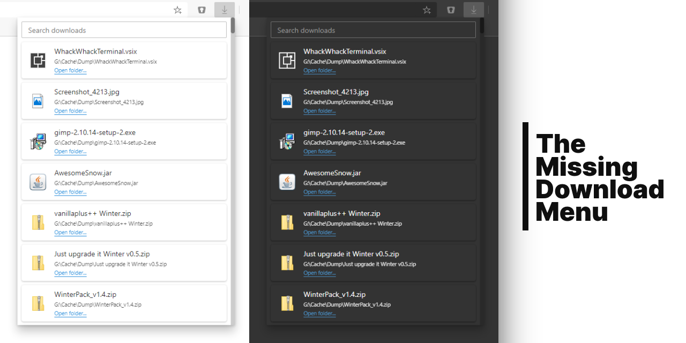

Don't you hate it when you download a file and it drops to the lower download bar, but then disappears even though you were about to click on your download?

Or how about this: Don't you think the downloads overview page is a bit overkill when you want to retrieve or open your most recent download?

Well worry no more. This plugin is designed to provide a menu in your Chromium based browser that shows all recent downloads in a non-obstrusive way. Not more or less, it's simple as that.

Built with [React](https://create-react-app.dev/) and [FAST-DNA](https://fast.design/).

## Features
- Access your downloads from your menu bar
- Automatic dark and light mode
- Integrates well to Edge's design system
- Search
- Also works on Chrome

## Development setup
I recommend to either **use WSL or a Linux environment for development** since the npm scripts are tailered for these environment. You'll need to have yarn installed.

### Debug extension
- First time? Do `yarn` to install all dependencies
- Build the extension with `yarn build`
- Go to Edge -> Extensions -> Turn on Developer Mode
- Hit `Load unpacked` and select to the root of the `./build` folder
- Happy debugging